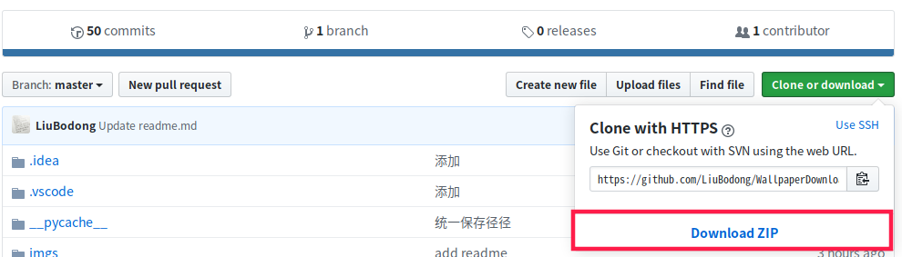
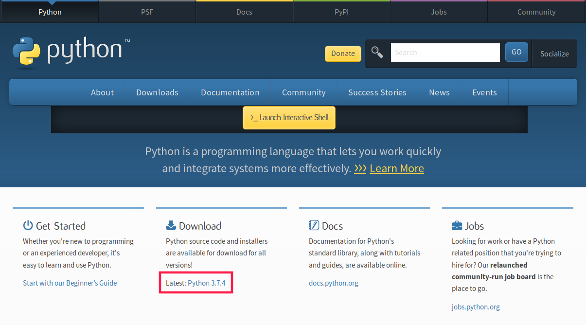
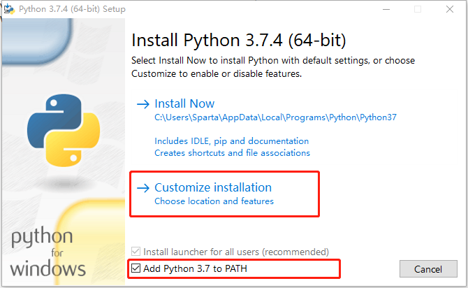
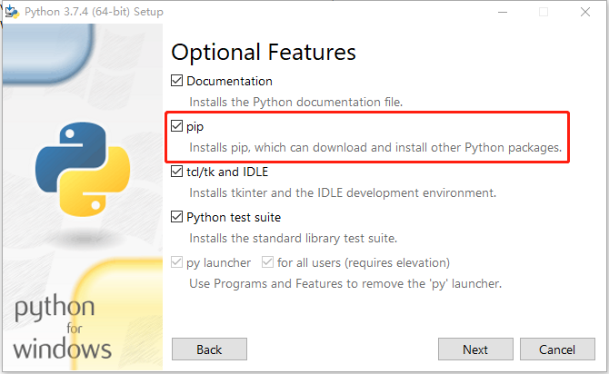
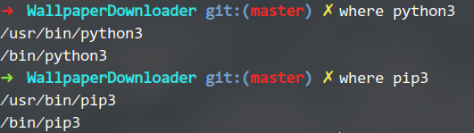
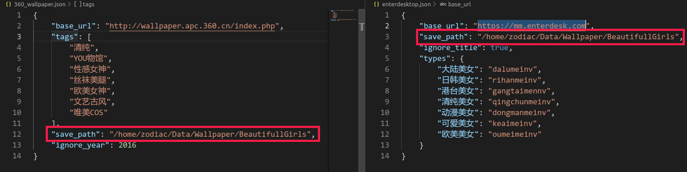

# 壁纸&妹子图片下载工具
### 下载项目到电脑

解压zip包
***
### 下载Python3
* ### Windows用户
   下载Windows版本的Python3，根据系统架构选择64位或32位版本
      
   按照程序引导， 勾选 "Install Pip"，"Add Python3 to Path"选项。
    
   
    之后一路Next
* ### Linux用户
    首先检查有没有安装Python3和pip
    
    
    
    如果能正确打印python和pip路径则说明已经安装python3和pip。否则：
    * 对于Debian系用户(Debian, Ubuntu, Deepin等):
    ```
    sudo apt insall python3 pip3
    ```
    * 对于Redhat系用户(ReadHat, Fedora, Centos等):
    ```
    sudo yum install python3 pip3
    ```
***
### 其次安装必要组件
* ### Windows用户
    点击开始按钮搜索"powershell" -> 右键 -> "以管理员身份运行" -> 输入 "pip install beautifulsoup4"
* ### Linux用户
    ```
    sudo pip install beautifulsoup4
    ```
***
### 设置图片保存路径
#### **以下文件使用文本编辑器来编辑**

下载工具可以下载来自"[回车壁纸](https://mm.enterdesk.com)"和"360壁纸"的壁纸文图片，分别在"enterdesktop.json"和"360_wallpaper.json"中配置"save_path"选项。


其余下载美女图片的需要在\"savepath.py\"中配置, 配置方法同上。
***
### 开始下载
打开命令窗口
* ### Windows用户
    在解压好的文件夹下, 使用<kbd>Shift</kbd>+<kbd>鼠标右键</kbd>, 在弹出的菜单中点击"在此处打开Powershell窗口(S)"
* ### Linux用户
    在解压好的文件夹下, 使用<kbd>鼠标右键</kbd>, 在弹出的菜单中点击"在这里打开终端"
    
执行命令:
```
python3 filename
```
把上述命令中的filename换做想要执行的文件名即可
***
如果下载失败可以按<kbd>↑</kbd>重复上一条命令，回车后重新运行程序。
### 文件列表
| 文件名 | 名称 | 网站 | 网站是否可用 |
|:----  |:---- |:---- |:----|
|2717.py|2717  |https://www.2717.com/|是|
|enterdesktop.py|回车壁纸|https://mm.enterdesk.com/|是|
|ilemiss.py|艾乐美女|https://www.ilemiss.net/|是|
|jsmeinv.py|绝色美女|http://www.jsmeinv.com|否|
|ku137.py|美女写真网|https://www.ku137.net/|是|
|meitulianmeng.py|美图联盟|https://www.meitulm.com/|是|
|meitulu.py|美图录|https://www.meitulu.com/|是|
|meituri.py|美图日|https://www.meituri.com/|是|
|meizitu.py|妹子图|https://www.mzitu.com|是|
|mm131.py|mm131|http://www.mm131.com/|否|
|muzitu.py|木子图|https://www.muzishan.com/|是|
|qihoo360_wallpaper.py|360壁纸||是|
|walltu.py|哇图网|https://www.walltu.com|是|
|yixiu.py|亿秀网|http://www.tu11.com|是|

### 问题&反馈
   请联系QQ:925023770
   不胜感激
